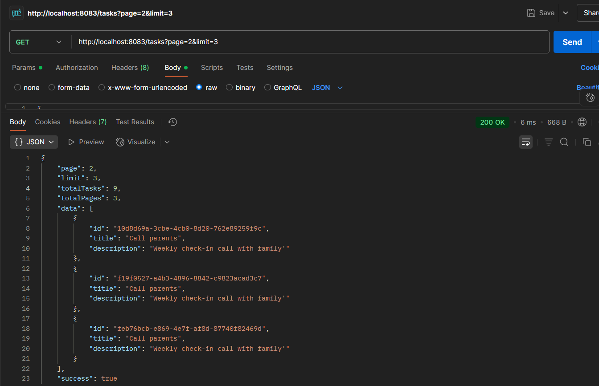
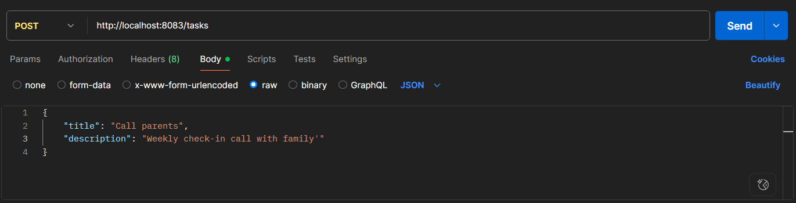
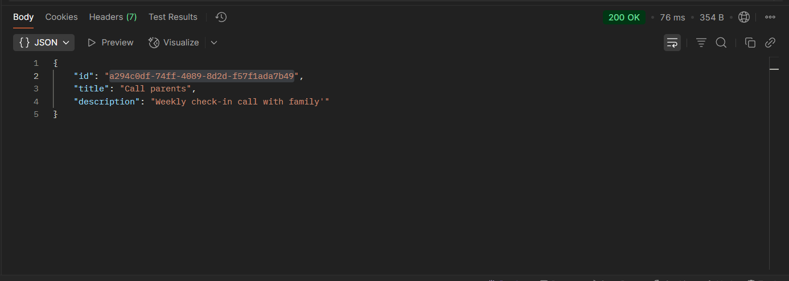
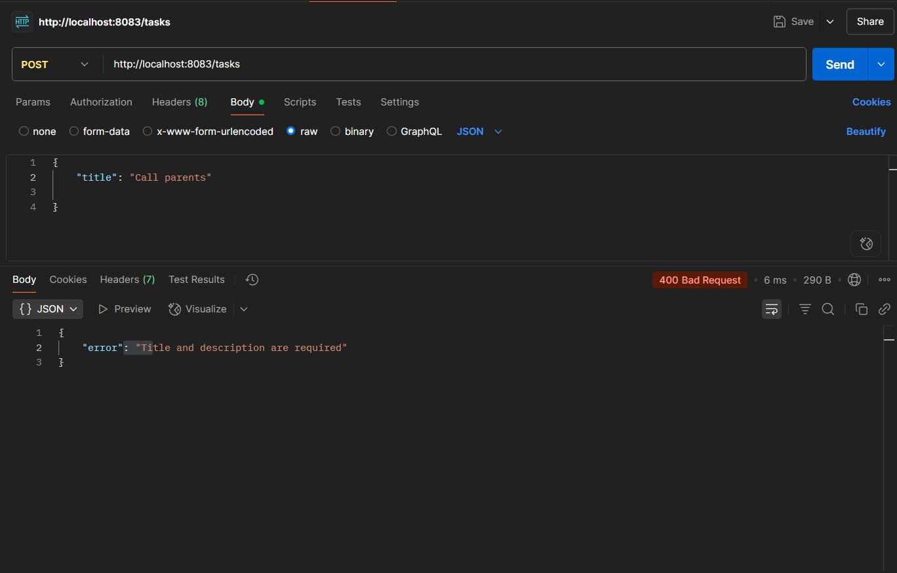
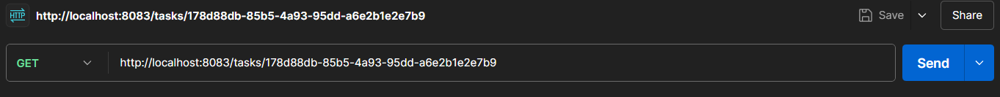
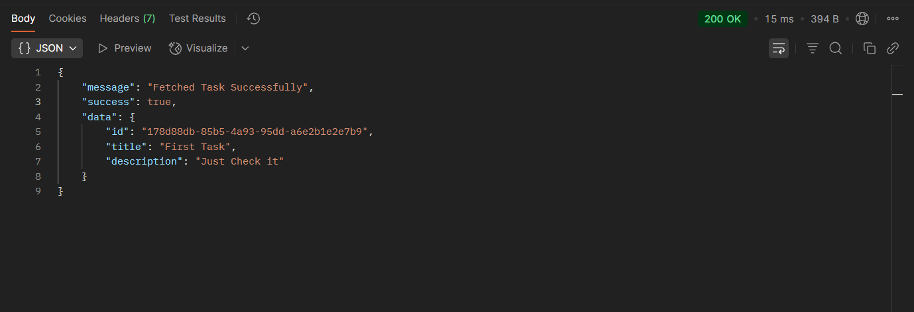
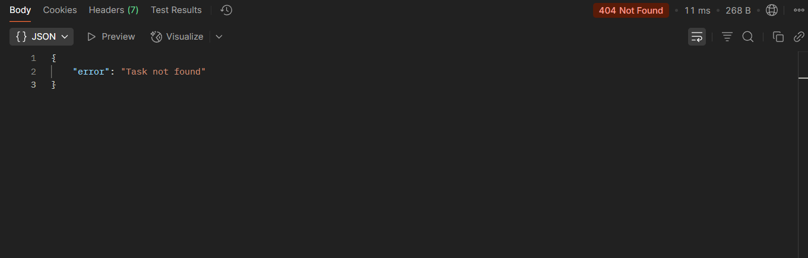
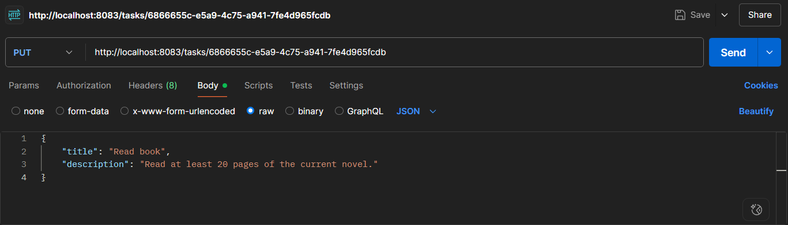
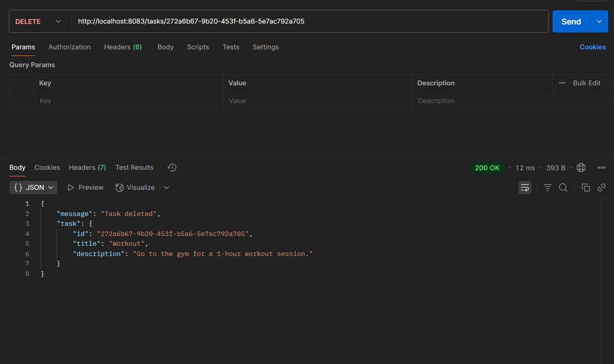

📘 Project Title: Task Manager API

📄 Description:
A simple RESTful API built using Node.js and Express.js to perform CRUD (Create, Read, Update, Delete) operations on tasks. This API stores tasks in memory and supports endpoints to manage task data. It also includes pagination support for efficiently retrieving large lists of tasks.

🚀 Features
    -Create, read, update, and delete tasks.
    -In-memory storage (no database).
    -Input validation for task fields.
    -Graceful error handling.
    -Clean and consistent REST API design.
    -Bonus implementation: Pagination.

⚙️ Technologies Used
    -Node.js
    -Express.js
    -JavaScript
    -Postman (for testing)

🧪 API Endpoints and Usage

    1. GET /tasks:
        🔍 Purpose: To retrieve a paginated list of all tasks.

        🔁 Supports Pagination:
            The endpoint accepts optional query parameters:
                page: The page number to retrieve (default = 1)
                limit: Number of tasks per page (default = 5)

        🧪 Sample Request:
            GET /tasks?page=2&limit=3
            Image Reference: 

        ✅ Sample Response:
            Image Reference: 

    2. Post/tasks:
        🔍 Purpose: To create a new task and add it to the in-memory task list.
                    Each task is automatically assigned a unique identifier (UUID) using the uuid library to ensure task IDs are globally unique.

        📥 Required Request Body (JSON):
            Image Reference: 

        ✅ Sample Response:
            Image Reference: 
                Success: 
                Bad Request: 

    3. GET /tasks/:id
        🔍 Purpose: To retrieve a specific task by its unique ID.

        🔑 Path Parameter: 
                :id — The unique identifier of the task to fetch.

        🧪 Sample Request:
            Image Reference: 

        ✅ Sample Success Response (200 OK):
                Image Reference: 
                    Success: 
                    Not Found: 

    4. PUT /tasks/:id
        🔄 Purpose: To update an existing task by its unique ID.

        🔑 Path Parameter: :id — The unique identifier of the task to update.

        📥 Required Body Parameters (JSON):
            title: (string) The updated title of the task.
            description: (string) The updated description of the task.

            Image Reference: 

        ✅ Sample Success Response (200 OK):
            Image Reference: 

    5. DELETE /tasks/:id
        🗑️ Purpose: To delete a specific task by its unique ID.

        🔑 Path Parameter: :id — The unique identifier of the task to delete.

        🧪 Sample Request & Response:
            Image Reference: 